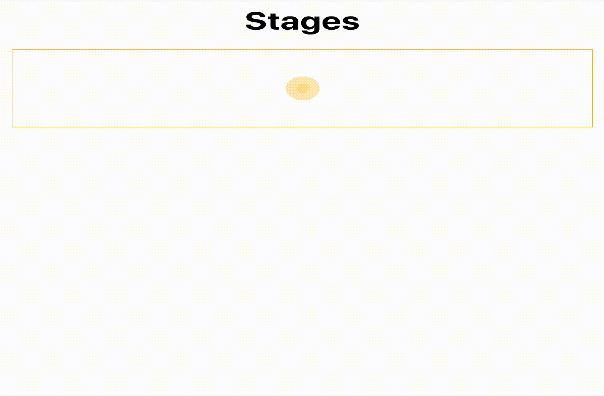

# React Stages

Você deverá reproduzir o mesmo comportamento deste [vídeo](https://drive.google.com/file/d/1pP5LeLh5WOuqIoRQIIndKCPITM63GA70/view?usp=sharing) também disponível no _gif_ abaixo:

  

- 👉 &nbsp; A partir do `data.json` construa um único `array` todos os dados necessários.
- 👉 &nbsp; Explique a abordagem que você utilizará na implementação utilizando comentários.
- 👉 &nbsp; Implemente seu código

## Regras

- ⚠️ &nbsp; Utilize o arquivo `data.json` para construir as suas etapas.
- ⚠️ &nbsp; O `render state` deve estar no componente `Parent`.
- ⚠️ &nbsp; O componente `Child` deve manipular a atualização do componente `Parent` através de um `callback`.
- ⚠️ &nbsp; Utilize apenas `Hooks`.

Sugerimos usar o `styled-minimal` nos estilos, uma vez que já tem os recursos necessários, mas fique à vontade para usar outra solução.

- 📚 &nbsp; Referência [https://wabi-sabi.surge.sh/](https://wabi-sabi.surge.sh/)

## Bônus
- ⏲ &nbsp; Renderizar uma mensagem no componente `Parent` após o término do ciclo com a duração exata...
- 🧪 &nbsp; Testes
